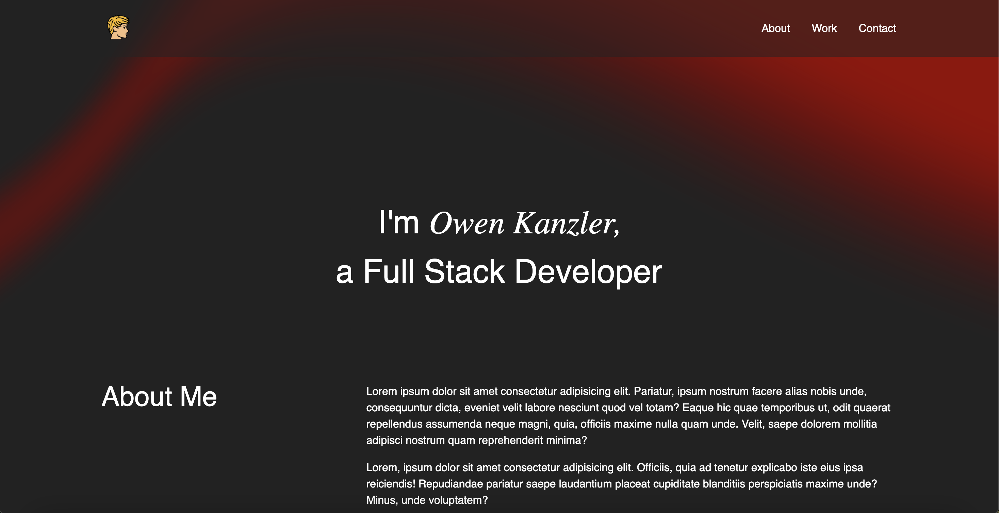

# challenge02-owen-kanzler

## Description

This is challenge 02 of the UMN Bootcamp. Here I created a personal portfolio page using HTML and CSS that includes an about section, work section, and a contact section. I used git and github to push, pull, and deploy the app.

## Assets

## Usage

https://owenkanzler.github.io/challenge02-owen-kanzler/

## License

Please refer to the LICENSE in the repo.
